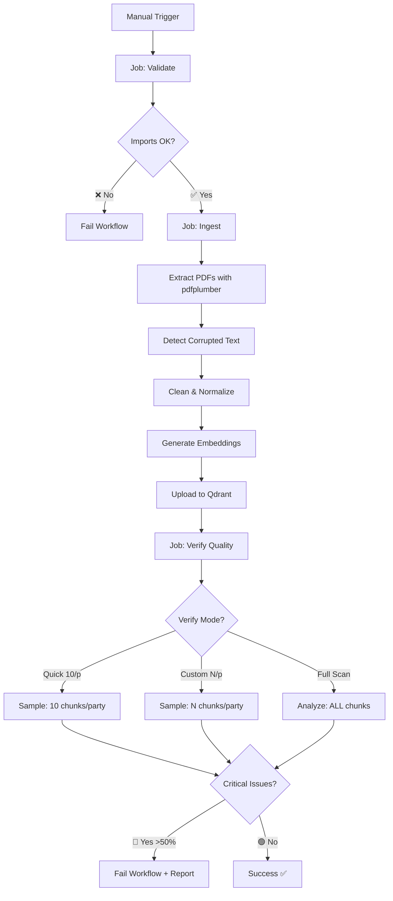

# Ingest Workflow - Data Quality Pipeline

## 🔄 Flujo del Workflow



## 📋 Jobs Detallados

### 1️⃣ **Validate**
- Instala dependencias con `uv`
- Verifica que todos los imports funcionan
- Rápido (~30 segundos)

### 2️⃣ **Ingest** 
**Parámetros:**
- `embedding_provider`: `sentence_transformers` o `openai` (default: `openai`)
- `embedding_model`: nombre del modelo (default: `text-embedding-3-large`)
- `recreate_collection`: Si `true`, elimina y recrea la colección desde cero (default: `false`)

**Flujo:**
- **Extracción Robusta de PDFs:**
  - Intenta `pdfplumber` (mejor encoding)
  - Fallback a `pypdf` estándar
  - Fallback a `pypdf` layout mode
  
- **Detección de Corrupción:**
  - Analiza ratio de caracteres inválidos
  - Threshold: 30% de caracteres no-ASCII válidos
  - Log warning si detecta problemas

- **Limpieza Automática:**
  - Normaliza whitespace
  - Corrige encoding español común
  - Elimina caracteres de control

- **Ingesta a Qdrant:**
  - Si `recreate_collection=true`: elimina colección existente primero
  - Genera embeddings por chunk
  - Upsert con deduplicación por hash
  - Index por `partido` y `doc_id`

### 3️⃣ **Verify Quality** 🆕
- **Análisis Exhaustivo:**
  - Revisa TODOS los chunks en Qdrant
  - Calcula métricas por partido
  - Identifica texto corrupto

- **Criterios de Fallo:**
  - 🟢 **OK**: < 10% corrupción
  - 🟡 **Warning**: 10-50% corrupción (pasa pero alerta)
  - 🔴 **Critical**: > 50% corrupción (falla el workflow)

- **Reporte Detallado:**
  ```
  ================================================================================
  PARTIDO    CHUNKS   CORRUPTED    AVG CORRUPT %   STATUS    
  ================================================================================
  PPSO       75       0            2.3             🟢 OK
  PLN        82       0            1.8             🟢 OK
  ```

- **Exit Codes:**
  - `0`: Todo OK
  - `1`: Problemas críticos detectados (solo en CI)

## 🚀 Cómo Usar

### Opción 1: GitHub UI (Recomendado)

1. Ve a **Actions** → **Ingest Data**
2. Click **Run workflow**
3. Completa los inputs:
   - **qdrant_url**: `https://your-qdrant.cloud` o `http://localhost:6333`
   - **collection_name**: `planes_gobierno` (default)
   - **embedding_provider**: `openai` (recomendado) o `sentence_transformers`
   - **embedding_model**: `text-embedding-3-large` (mejor calidad)
   - **recreate_collection**: `false` (default) o `true` para reset completo
   - **verify_mode**: `quick` | `custom` | `full` (default: `quick`)
   - **verify_sample_size**: `10` (solo si verify_mode=custom)

### 📋 Ejemplos Prácticos

#### Ejemplo 1: Ingesta Completa (Recomendado)
```
qdrant_url: https://your-qdrant.cloud
embedding_provider: openai
embedding_model: text-embedding-3-large
recreate_collection: false      ← Incremental
verify_mode: quick              ← Rápido
```

**Resultado:**
```
📝 Incremental mode: Will update only changed files
📌 SAMPLING MODE: Checking 10 chunks per party
✅ Ingestion completed successfully
✅ QUALITY CHECK PASSED
```

#### Ejemplo 2: Recreate + Verificación Completa (Auditoría)
```
qdrant_url: https://your-qdrant.cloud
recreate_collection: true       ← ⚠️ BORRA TODO
verify_mode: full               ← Verificación completa
```

**Resultado:**
```
🔄 RECREATE MODE: Deleting existing collection...
✅ Deleted collection
📦 Creating collection...
[100%] Processing all PDFs...
🔍 Analyzing chunk quality in Qdrant...
VERIFY_FULL_SCAN=true (TODOS los chunks)
✅ QUALITY CHECK PASSED
```

#### Ejemplo 3: Ingesta + Verificación Personalizada
```
qdrant_url: https://your-qdrant.cloud
verify_mode: custom
verify_sample_size: 20          ← 20 chunks por partido
```

**Resultado:**
```
📌 SAMPLING MODE: Checking 20 chunks per party
Analyzed 400 chunks from 20 parties
   (20 samples per party, ~400 total)
✅ QUALITY CHECK PASSED
```
📝 Incremental mode: Will update only changed files
📦 Using existing collection 'planes_gobierno'
[PLN.pdf] → SKIP (no changes)
[PPSO.pdf] → Updated (file changed)
✅ Ingestion completed successfully!
```

### Ejemplo: Modo Recreate (reset completo)
```
qdrant_url: https://your-qdrant.cloud
collection_name: planes_gobierno
embedding_provider: openai
embedding_model: text-embedding-3-large
recreate_collection: true  ← ⚠️ BORRARÁ TODO Y EMPEZARÁ NUEVO
```

**Resultado:**
```
🔄 RECREATE MODE ENABLED: Will delete and recreate collection from scratch
✅ Deleted collection 'planes_gobierno'
📦 Creating collection 'planes_gobierno'...
[ACRM.pdf] → Created 12 chunks
[CA.pdf] → Created 15 chunks
...
✅ Ingestion completed successfully!
```

### Opción 2: GitHub CLI

```bash
# Modo rápido (default)
gh workflow run ingest.yml \
  -f qdrant_url="https://your-qdrant.cloud" \
  -f embedding_provider="openai"

# Modo custom: 20 samples por partido
gh workflow run ingest.yml \
  -f qdrant_url="https://your-qdrant.cloud" \
  -f verify_mode="custom" \
  -f verify_sample_size="20"

# Modo completo: auditoría (recreate + full scan)
gh workflow run ingest.yml \
  -f qdrant_url="https://your-qdrant.cloud" \
  -f recreate_collection="true" \
  -f verify_mode="full"

# Modo recreate: reset completo con quick verify
gh workflow run ingest.yml \
  -f qdrant_url="https://your-qdrant.cloud" \
  -f recreate_collection="true" \
  -f verify_mode="quick"
```

### Opción 3: API

```bash
curl -X POST \
  -H "Authorization: token $GITHUB_TOKEN" \
  -H "Accept: application/vnd.github.v3+json" \
  https://api.github.com/repos/glizano/eleccionescr/actions/workflows/ingest.yml/dispatches \
  -d '{
    "ref": "main",
    "inputs": {
      "qdrant_url": "https://your-qdrant.cloud",
      "embedding_provider": "openai"
    }
## 🔍 Job 3: Verify Quality (OPTIMIZADO CON MODOS)

Este job ahora usa **sampling inteligente** con 3 modos configurables:

### Modo Quick (Default - Recomendado) ⚡
```
Chunks: 10 por partido (~200 total)
Tiempo: 2-5 segundos
Carga Qdrant: Mínima
Uso: Verificación post-ingesta
```

### Modo Custom 🎯
```
Chunks: N por partido (configurable: 5-50)
Tiempo: 1-30 segundos (depende de N)
Carga Qdrant: Baja
Uso: Balancear precisión vs velocidad
```

### Modo Full Scan 🔍
```
Chunks: TODOS los chunks
Tiempo: 5+ minutos (10,000+ chunks)
Carga Qdrant: Alta
Uso: Auditoría completa (una vez al trimestre)
```

**Flujo:**
1. Descubre partidos en la colección
2. Samplea N chunks según modo
3. Analiza corrupción y encoding
4. Falla si detecta >50% corrupción

### 📊 Cuadro Comparativo

| Modo | Chunks/Partido | Tiempo | Precisión | Para Qué |
|------|---------------|--------|-----------|----------|
| **Quick** | 10 | 2-5s | ~95% | CI/CD regular |
| **Custom(5)** | 5 | 1-2s | ~90% | Ultrarápido |
| **Custom(20)** | 20 | 5-10s | ~98% | Más precisión |
| **Full** | Todos | 5+min | 100% | Auditoría legal |

## ⚙️ Configuración del Workflow

El workflow ahora acepta dos nuevos parámetros:

```yaml
verify_mode:
  options:
    - quick        # 10 samples/party (default)
    - custom       # N samples/party (configurable)
    - full         # ALL chunks (lento)
  default: 'quick'

verify_sample_size:
  description: 'Para custom mode: 5-50'
  default: '10'
```
VERIFY_FULL_SCAN: true
```

## 🔐 Secretos Requeridos

En **Settings** → **Secrets and variables** → **Actions**, configura:

- **`OPENAI_API_KEY`** (requerido para embeddings OpenAI)
  - Obtén en: https://platform.openai.com/api-keys
  - Formato: `sk-proj-...`

- **`QDRANT_API_KEY`** (opcional, solo para Qdrant Cloud)
  - Obtén en tu dashboard de Qdrant Cloud
  - Déjalo vacío si usas Qdrant local/self-hosted

## ⚠️ Troubleshooting

### ❌ Job "Verify Quality" Falla

**Síntoma:**
```
🔴 CRITICAL ISSUES DETECTED in: PPSO, FA
```

**Causa:** PDFs con encoding corrupto o fuentes embebidas problemáticas

**Solución:**
1. **Revisa los PDFs localmente:**
   ```bash
   cd ingest
   python verify_quality.py
   ```

2. **Opciones para arreglar:**
   - Solicita mejor versión del PDF al partido
   - Convierte PDF a texto y re-genera
   - Usa OCR si el PDF es escaneado
   - Excluye temporalmente el partido problemático

3. **Actualiza el PDF y re-ejecuta:**
   - Reemplaza `ingest/data/raw/PPSO.pdf`
   - Commit y push
   - Re-ejecuta el workflow

### ❌ "OPENAI_API_KEY required for OpenAI embeddings"

**Causa:** Secreto no configurado

**Solución:**
1. Settings → Secrets → New repository secret
2. Name: `OPENAI_API_KEY`
3. Value: Tu API key de OpenAI

### ❌ Connection refused to Qdrant

**Causa:** URL incorrecta o Qdrant no accesible desde GitHub

**Solución:**
- Para Qdrant Cloud: Usa la URL HTTPS completa
- Para local: No puedes usar `localhost` desde GitHub Actions
  - Usa Railway, Render, o cualquier host público
  - O ejecuta ingesta localmente

## 📊 Métricas de Calidad

| Métrica | Descripción | Ideal |
|---------|-------------|-------|
| **Corruption Ratio** | % de chars no válidos | < 5% |
| **Avg Word Length** | Longitud promedio de palabras | 4-8 chars |
| **Chunks per Party** | Cantidad de chunks | 50-150 |
| **Critical Parties** | Partidos con >50% corrupción | 0 |

## 🎯 Best Practices

1. **Ejecuta después de actualizar PDFs**
2. **Revisa el log completo** incluso si pasa
3. **Monitorea warnings** (10-50% corrupción)
4. **Valida localmente primero** con `verify_quality.py`
5. **Usa `text-embedding-3-large`** para mejor calidad semántica

## 📚 Referencias

- [Extracción mejorada de PDFs](../../ingest/README.md)
- [Script verify_quality.py](../../ingest/verify_quality.py)
- [Documentación Qdrant](https://qdrant.tech/documentation/)
- [OpenAI Embeddings](https://platform.openai.com/docs/guides/embeddings)
